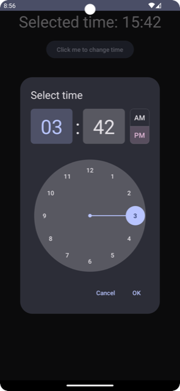

# Compose material3 Date[^1] and Time pickers


Highly customizable Jetpack Compose components with material3 support for date & time picking.




## Latest version

### 0.2.0 ([Changelog](https://github.com/marosseleng/compose-material3-datetime-pickers/compare/v0.1.2...v0.2.0))

#### Kotlin version: `1.7.20`

#### Compose compiler version: `1.3.2`

#### Compose BOM version: `2022.12.00`
For details of packages inside a BOM, download it's POM file from [Google's maven repository](https://maven.google.com/web/index.html?q=compose-bom#androidx.compose:compose-bom).

#### Material3 version: `1.0.1`

## Usage
To use this library in your project, in your app module's `build.gradle.kts` add:

```kotlin
dependencies {
    implementation("com.marosseleng.android:compose-material3-datetime-pickers:<LATEST_VERSION>")
}
```

### Java 8 and desugaring
This library uses the Java 8's `java.time` APIs such as `LocalDate` and `LocalTime`. If your `targetSdk` is less than `26`, you have to enable [desugaring](https://developer.android.com/studio/write/java8-support#library-desugaring):

In your module's `build.gradle.kts` add:
```kotlin
android {
    // ...
    compileOptions {
        isCoreLibraryDesugaringEnabled = true
        sourceCompatibility = JavaVersion.VERSION_1_8
        targetCompatibility = JavaVersion.VERSION_1_8
    }
}

dependencies {
    coreLibraryDesugaring("com.android.tools:desugar_jdk_libs:1.2.2")
}
```

#### For timepicker instructions see its [readme](docs/timepicker/README.md)
#### For datepicker instructions see its [readme](docs/datepicker/README.md)

## Contributing
While the library is currently ready to use as-is, until version `1.0.0` is released, it's API isn't considered stable. Contributions in the form of API changes suggestions and discussions are very welcome. 

## License
```
   Copyright 2022 Maroš Šeleng

   Licensed under the Apache License, Version 2.0 (the "License");
   you may not use this file except in compliance with the License.
   You may obtain a copy of the License at

       http://www.apache.org/licenses/LICENSE-2.0

   Unless required by applicable law or agreed to in writing, software
   distributed under the License is distributed on an "AS IS" BASIS,
   WITHOUT WARRANTIES OR CONDITIONS OF ANY KIND, either express or implied.
   See the License for the specific language governing permissions and
   limitations under the License.
```


[^1]: Date picker for range selection is still a work in progress.