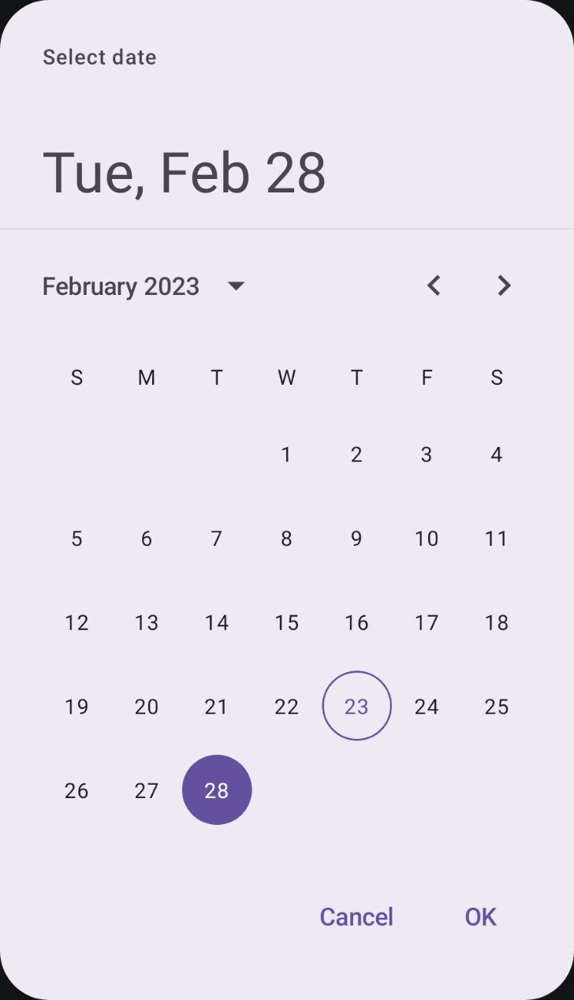
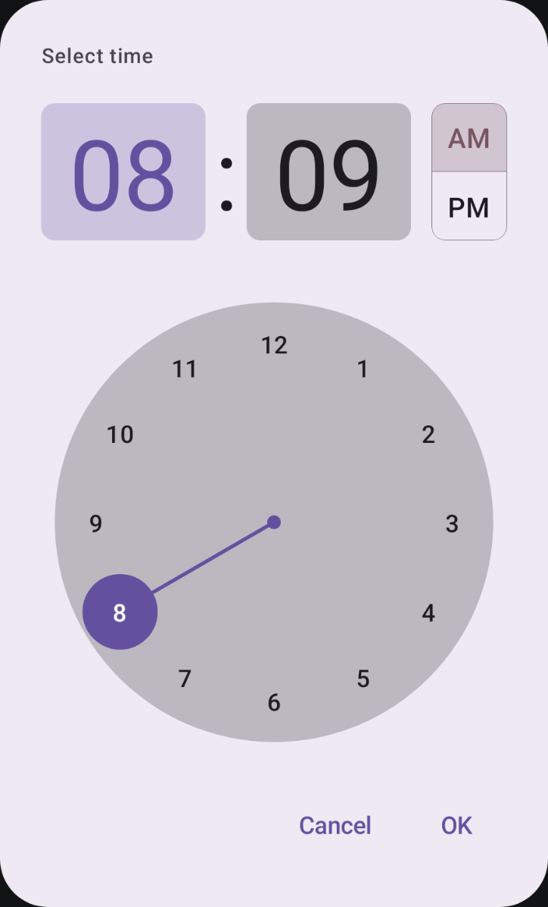

# Compose material3 Date[^1] and Time pickers


Highly customizable Jetpack Compose components with material3 support for date & time picking.



## Contents
* [Latest version](#latest-version)
* [Versions](#versions)
* [Usage](#usage)
  * [Single-date Datepicker](#single-date-datepicker)
  * [Timepicker](#timepicker)
  * [Java 8 and desugaring](#java-8-and-desugaring)
* [Contributing](#contributing)
* [License](#license)

## Latest version

### 0.6.2 ([Changelog](https://github.com/marosseleng/compose-material3-datetime-pickers/compare/v0.6.1...v0.6.2))

## Versions
| Dependency                                                                                        |      Version |
|:--------------------------------------------------------------------------------------------------|-------------:|
| Kotlin                                                                                            |     `1.8.10` |
| Compose compiler                                                                                  |      `1.4.2` |
| [Compose BOM](https://maven.google.com/web/index.html?q=compose-bom#androidx.compose:compose-bom) | `2023.01.00` |
| Material3                                                                                         |      `1.0.1` |

## Usage
To use this library in your project, in your app module's `build.gradle.kts` add:

```kotlin
dependencies {
    implementation("com.marosseleng.android:compose-material3-datetime-pickers:<LATEST_VERSION>")
}
```

### Single-date Datepicker
To display a datepicker dialog for a single-date selection, just call
```kotlin
@Composable
fun DatePickerDialog(
    onDismissRequest: () -> Unit,
    onDateChange: (LocalDate) -> Unit,
    modifier: Modifier = Modifier,
    initialDate: LocalDate? = null,
    locale: Locale = LocalConfiguration.current.getDefaultLocale(),
    today: LocalDate = LocalDate.now(),
    showDaysAbbreviations: Boolean = true,
    highlightToday: Boolean = true,
    colors: DatePickerColors = DatePickerDefaults.colors(),
    shapes: DatePickerShapes = DatePickerDefaults.shapes(),
    typography: DatePickerTypography = DatePickerDefaults.typography(),
    title: @Composable (() -> Unit)? = null,
    shape: Shape = AlertDialogDefaults.shape,
    containerColor: Color = AlertDialogDefaults.containerColor,
    titleContentColor: Color = AlertDialogDefaults.titleContentColor,
    tonalElevation: Dp = AlertDialogDefaults.TonalElevation,
    properties: DialogProperties = DialogProperties(usePlatformDefaultWidth = false),
)
```
There are only 2 required parameters:
* `onDismissRequest` - called when the dialog should be dismissed without user selecting a value
* `onDateChange` - called when user selected a value, passing it as a parameter

It is, however, recommended to also fill the `title` parameter, as it provides the title for the dialog.

Remaining parameters as well as the customization guide is described in the separate [README](docs/datepicker/README.md).

### Timepicker
To display a timepicker dialog, call
```kotlin
@Composable
fun TimePickerDialog(
    onDismissRequest: () -> Unit,
    onTimeChange: (LocalTime) -> Unit,
    modifier: Modifier = Modifier,
    initialTime: LocalTime = LocalTime.now().noSeconds(),
    locale: Locale = LocalConfiguration.current.getDefaultLocale(),
    is24HourFormat: Boolean = DateFormat.is24HourFormat(LocalContext.current),
    colors: TimePickerColors = TimePickerDefaults.colors(),
    shapes: TimePickerShapes = TimePickerDefaults.shapes(),
    typography: TimePickerTypography = TimePickerDefaults.typography(),
    title: @Composable (() -> Unit)? = null,
    shape: Shape = AlertDialogDefaults.shape,
    containerColor: Color = AlertDialogDefaults.containerColor,
    tonalElevation: Dp = AlertDialogDefaults.TonalElevation,
    properties: DialogProperties = DialogProperties(),
)
```
The 2 required parameters are:
* `onDismissRequest` - called when the dialog should be dismissed without user selecting a value
* `onTimeChange` - called when user selected a value, passing it as a parameter

It is, however, recommended to also fill the `title` parameter, as it provides the title for the dialog.

Remaining parameters as well as the customization guide is described in the separate [README](docs/timepicker/README.md).

### Java 8 and desugaring
This library uses the Java 8's `java.time` APIs such as `LocalDate` and `LocalTime`. If your `targetSdk` is less than `26`, you have to enable [desugaring](https://developer.android.com/studio/write/java8-support#library-desugaring):

In your module's `build.gradle.kts` add:
```kotlin
android {
    // ...
    compileOptions {
        isCoreLibraryDesugaringEnabled = true
        sourceCompatibility = JavaVersion.VERSION_1_8
        targetCompatibility = JavaVersion.VERSION_1_8
    }
}

dependencies {
    // ...
    coreLibraryDesugaring("com.android.tools:desugar_jdk_libs:1.2.2")
}
```

## Contributing
While the library is currently ready to use as-is, until version `1.0.0` is released, it's API isn't considered stable. Contributions in the form of API changes suggestions and discussions are very welcome. 

## License
```
Copyright 2022 Maroš Šeleng

Licensed under the Apache License, Version 2.0 (the "License");
you may not use this file except in compliance with the License.
You may obtain a copy of the License at

   http://www.apache.org/licenses/LICENSE-2.0

Unless required by applicable law or agreed to in writing, software
distributed under the License is distributed on an "AS IS" BASIS,
WITHOUT WARRANTIES OR CONDITIONS OF ANY KIND, either express or implied.
See the License for the specific language governing permissions and
limitations under the License.
```


[^1]: Date picker for range selection is still a work in progress.