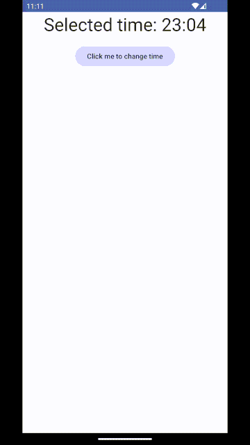
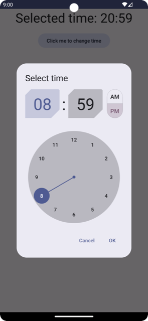

# Time picker

A highly customizable time picker for Jetpack Compose. Material3 theme-compatible.



## Contents
* [Usage](#usage)
* [Customization](#customization)

## Usage

Minimal working example of a timepicker dialog usage (see below for parameter descriptions):

```kotlin
var isDialogShown: Boolean by rememberSaveable {
    mutableStateOf(false)
}
val (selectedTime, setSelectedTime) = rememberSaveable {
    mutableStateOf(LocalTime.now().noSeconds())
}
if (isDialogShown) {
    TimePickerDialog(
        onDismissRequest = { isDialogShown = false },
        initialTime = selectedTime,
        onTimeChange = {
            setSelectedTime(it)
            isDialogShown = false
        },
        title = { Text(text = "Select time") }
    )
}
```

`TimePickerDialog` with all parameters:
```kotlin
@Composable
fun TimePickerDialog(
    onDismissRequest: () -> Unit,
    onTimeChange: (LocalTime) -> Unit,
    modifier: Modifier = Modifier,
    initialTime: LocalTime = LocalTime.now().noSeconds(),
    locale: Locale = LocalConfiguration.current.getDefaultLocale(),
    is24HourFormat: Boolean = DateFormat.is24HourFormat(LocalContext.current),
    colors: TimePickerColors = TimePickerDefaults.colors(),
    shapes: TimePickerShapes = TimePickerDefaults.shapes(),
    typography: TimePickerTypography = TimePickerDefaults.typography(),
    title: @Composable (() -> Unit)? = null,
    shape: Shape = AlertDialogDefaults.shape,
    containerColor: Color = AlertDialogDefaults.containerColor,
    tonalElevation: Dp = AlertDialogDefaults.TonalElevation,
    properties: DialogProperties = DialogProperties(),
)
```
* `onDismissRequest` - called when the dialog should be dismissed without user selecting a value
* `onTimeChange` - called when user selected a value, passing it as a parameter
* `modifier` - a `Modifier` for the root `@Composable`
* `initialTime` - an initially-selected `LocalTime`
* `locale` - `java.util.Locale` used to display user-visible strings, such as AM/PM strings
* `is24HourFormat` - whether or not to show the 24-hour picker
* `colors` - an instance of `TimePickerColors` used to theme the component (see below for more info)
* `shapes` - an instance of `TimePickerShapes` used to theme the component (see below for more info)
* `typography` - an instance of `TimePickerTypography` used to theme the component (see below for more info)
* `title` - a `@Composable` slot for the dialog title - usually `{ Text("Select time") }` or similar
* `shape` - the shape of the `AlertDialog`
* `containerColor` - the container color of the `AlertDialog`
* `tonalElevation` - the tonal elevation of the `AlertDialog`
* `properties` - `DialogProperties` of the `AlertDialog`

## Customization
Timepicker dialog provides several ways of customizing its looks. Starting with `is24HourFormat`, continuing to the more complex combination of different `Color`, `Shape` and `Typography`.

Timepicker dialog offers **out-of-the-box support for light/dark theming** and [Material You dynamic colors](https://m3.material.io/styles/color/dynamic-color/overview), as long as your `MaterialTheme` is defined correctly.

The components use the design tokens that reference attributes from the `MaterialTheme`.

For example, passing

```kotlin
TimePickerDialog(
    // ...
    shapes = TimePickerDefaults.shapes(
        clockDigitsShape = CutCornerShape(topStart = 16.dp, topEnd = 3.dp, bottomStart = 0.dp, bottomEnd = 24.dp),
        amPmSwitchShape = CircleShape,
    ),
)
```
produces



In the similar way you can customize `colors`, `typography`, and even the looks of the `AlertDialog` itself.

For default values see [TimePickerDefaults](../../datetimepickers/src/main/java/com/marosseleng/compose/material3/datetimepickers/time/domain/TimePickerDefaults.kt).